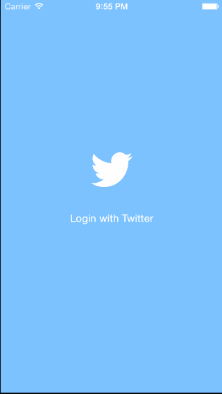
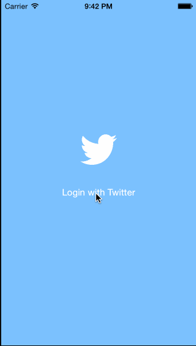

TW33Tme
========
Twitter iOS Demo App

This is an iOS 7 demo app displaying twitter home timeline and supporting features like compose, retweet, and favorite using [Twitter API](https://dev.twitter.com/docs/api/1.1). It is created as part of [CodePath](http://codepath.com/) course work. 

Part 2
--------
July 1, 2014

Time spent: approximately 20 hours 

### Features

#### Required
- [x] __Hamburger menu__: Dragging anywhere in the view should reveal the menu.
- [x] __Hamburger menu__: The menu should include links to your profile, the home timeline, and the mentions view.
- [x] __Profile page__: contains the user header view.
- [x] __Profile page__: contains a section with the users basic stats.
- [x] __Timeline__: tapping on a user image should bring up that user's profile page

#### Optional
- [x] __Profile page__: implement the paging view for the user description.
- [x] __Profile page__: Pulling down the profile page should blur and resize the header image.
- [ ] __Profile page__: As the paging view moves, increase the opacity of the background screen.
- [ ] Account switching

### Walkthrough

### Credits
* [How to Create a Slide-Out Navigation Panel](http://www.raywenderlich.com/32054/how-to-create-a-slide-out-navigation-like-facebook-and-path)
* [How to fix UITableView separator on iOS 7](http://stackoverflow.com/questions/18773239/how-to-fix-uitableview-separator-on-ios-7)
* [The simplest way to resize an UIImage?](http://stackoverflow.com/questions/2658738/the-simplest-way-to-resize-an-uiimage)
* Icons
  * [Menu](http://thenounproject.com/term/menu/53129/)
  * [User](http://thenounproject.com/term/user/7078/)
  * [Timeline](http://thenounproject.com/term/timeline/8254/)
  * [Speech bubble](http://thenounproject.com/term/speech-bubble/48626/)
  * [Edit](http://thenounproject.com/term/edit/31085/)

Part 1
--------
June 24, 2014

Time spent: approximately 15 hours

### Features

#### Required
- [x] User can sign in using OAuth login flow
- [x] User can view last 20 tweets from their home timeline
- [x] The current signed in user will be persisted across restarts
- [x] In the home timeline, user can view tweet with the user profile picture, username, tweet text, and timestamp.
- [x] User can pull to refresh
- [x] User can compose a new tweet by tapping on a compose button.
- [x] User can tap on a tweet to view it, with controls to retweet, favorite, and reply.

#### Optional
- [ ] When composing, you should have a countdown in the upper right for the tweet limit.
- [ ] After creating a new tweet, a user should be able to view it in the timeline immediately without refetching the timeline from the network.
- [x] Retweeting and favoriting should increment the retweet and favorite count.
- [x] User should be able to unretweet and unfavorite and should decrement the retweet and favorite count.
- [x] Replies should be prefixed with the username and the reply_id should be set when posting the tweet,
- [ ] User can load more tweets once they reach the bottom of the feed using infinite loading similar to the actual Twitter client.

### Walkthrough

### Credits
* [Twitter API](https://dev.twitter.com/docs/api/1.1)
* [Icons](http://thenounproject.com)
  * http://thenounproject.com/term/refresh/2223/
  * http://thenounproject.com/term/arrow/16880/
  * http://thenounproject.com/term/star/3307/
* [DateTools](https://github.com/MatthewYork/DateTools)
* [Getting UITableViewCell with superview in iOS 7](http://stackoverflow.com/questions/18962771/getting-uitableviewcell-with-superview-in-ios-7)